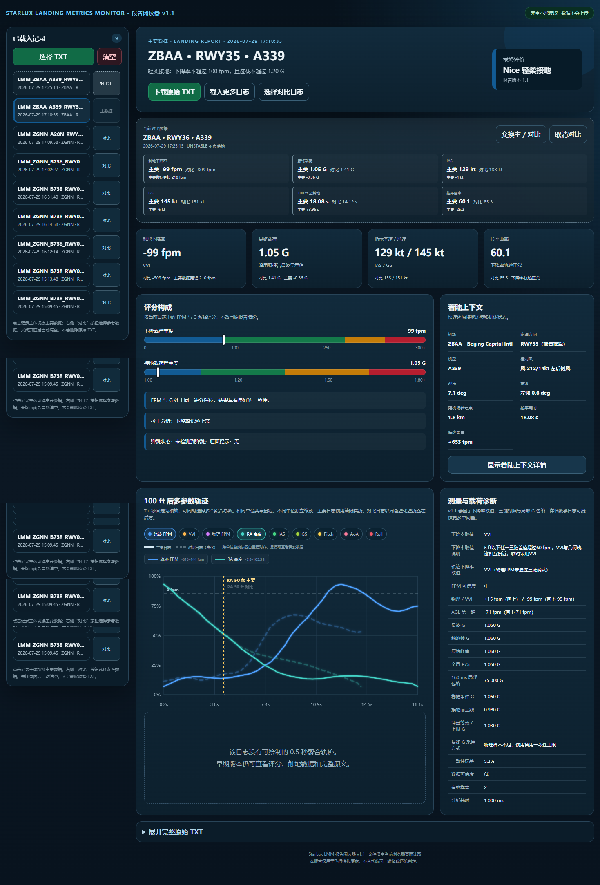
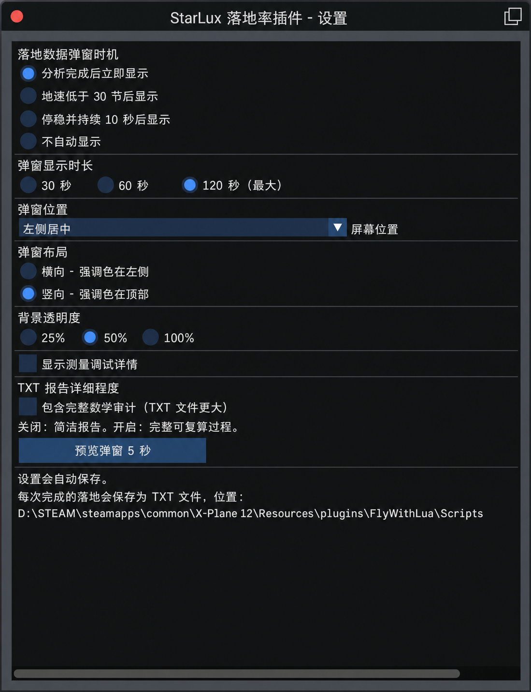
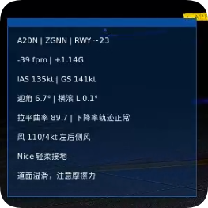
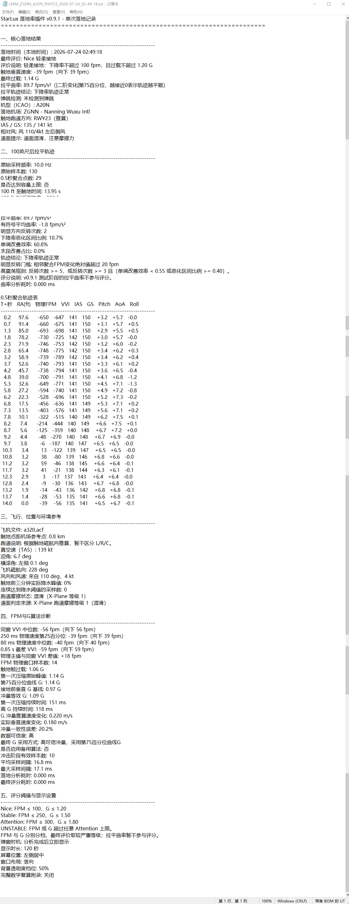

# StarLux Landing Meter

[](https://github.com/Starlux531/StarLux-Landing-Meter/releases)
[](LICENSE)
[](https://www.x-plane.com/)

StarLux Landing Meter 是一款适用于 X-Plane 12 与 FlyWithLua NG+ 的落地分析插件。它会采集触地阶段的垂直速度、载荷、姿态、速度、风况和拉平轨迹，在游戏内给出结果，并生成可复盘、可对比、可复算的本地中文报告。

> **v1.1 正式版**现已发布：新增三链 FPM 验证、局部 G 包络、回放隔离、四种弹窗模式和多参数报告图表。

## v1.1 正式版功能

- 在 5 ft 以下同一终端窗口内交叉验证物理轨迹、VVI 与 AGL 几何轨迹三种下降率
- 三组结果一致时采用物理轨迹；出现明显差异或样本不足时自动采用 VVI，并在 TXT 中保留对照数据
- G 值结合垂直投影、全局 P75、160 ms 局部冲击包络、冲量和实际速度变化进行判断
- 使用固定环形缓冲区和分阶段计算，避免把机场查询、日志写入和复杂分析集中在触地关键帧
- 记录机型、落地机场、推算跑道号、IAS、TAS、GS、迎角、横滚、磁航向和风况
- 从 100 ft 开始采集并聚合拉平轨迹，计算拉平曲率和轨迹震荡结论
- 检测 Bounce Landing，并按既定规则降级非红色评价
- 低高度阶段监测降水与 X-Plane 跑道摩擦状态，保留明确的提示来源
- 提供 Nice、Stable、Attention、UNSTABLE 四级评价；UNSTABLE 对外表述为“不良落地”
- 独立设置窗口：四种弹窗模式、30/60/120 秒时长、九宫格位置、横/竖布局、三档透明度和详细数学日志
- 提供“分析后立刻”“低于 30 kt”“停稳 10 秒”“不自动弹窗”四种显示时机
- 回放模式停止采样、触发和报告写入，退出回放后重置瞬时状态
- 自动生成 UTF-8 中文 TXT，文件名包含机场、机型与跑道
- 游戏内记录管理窗口可浏览、打开或删除最近日志
- 统一的本地网页阅读器：插件内打开和独立打开使用同一套界面
- 支持选择第二份日志进行对比，显示关键差值并叠加 100 ft 拉平轨迹
- 100 ft 图表可同时选择轨迹 FPM、VVI、物理 FPM、RA、IAS、GS、Pitch、AoA 与 Roll，使用独立颜色和动态图例
- 全程本地运行，不联网、不上传飞行数据

## 界面展示

以下图片来自 v1.1 实际飞行与报告测试，展示游戏内数据窗、设置、TXT 报告和本地网页复盘体系。

### 浏览器可视化报告

<p align="center">
  
</p>

### 设置窗口（中文功能标注）

<p align="center">
  
</p>

> 为方便中文用户理解，此图对设置项进行了中文标注；实际 ImGui 标签可能因 FlyWithLua 字体环境显示为英文，功能与排列一致。

### 游戏内数据窗与 TXT 详细报告

<table>
  <tr>
    <td align="center" width="36%">
      <br>
      <sub>游戏内落地数据窗</sub>
    </td>
    <td align="center" width="64%">
      <br>
      <sub>可复盘、可复算的 TXT 详细落地报告</sub>
    </td>
  </tr>
</table>

## 运行要求

- X-Plane 12
- 支持浮动窗口与 ImGui 的 FlyWithLua NG+
- 用于打开报告的现代浏览器

## 安装

从 [GitHub Releases v1.1](https://github.com/Starlux531/StarLux-Landing-Meter/releases/tag/v1.1) 下载正式版压缩包，将其中内容放入：

```text
X-Plane 12/Resources/plugins/FlyWithLua/Scripts/
```

必需文件：

```text
StarLux_LMM_v1.1.lua
LMM_Report_Reader.html
LMM_Settings.cfg
LMM_Log/
```

如果安装过旧版本，请把旧版 `StarLux_LMM_*.lua` 移出 `Scripts`，避免多个版本同时运行。随后启动 X-Plane，或通过 FlyWithLua 重新加载所有 Lua 脚本。

## 游戏内入口

设置窗口：

```text
Plugins > FlyWithLua > FlyWithLua Macros > StarLux 落地率插件 | 打开设置
```

落地记录：

```text
Plugins > FlyWithLua > FlyWithLua Macros > StarLux 落地率插件 | 落地记录
```

也可以绑定设置命令：

```text
starlux/lmm/open_settings
```

设置窗口当前使用英文 ImGui 标签；宏菜单入口与命令说明已经中文化。

## 弹窗模式

| 模式 | 行为 |
|---|---|
| 分析完成后立刻 | 触地分析、评分和缓存完成后显示 |
| 地速低于 30 kt | 落地完成后等待滑跑速度降到阈值 |
| 停稳并持续 10 秒 | 地速不高于 1 kt 连续 10 秒后显示 |
| 不自动显示 | 仍生成报告，但不弹出落地数据窗 |

## 评分标准

| 评价 | 颜色 | 下降率 | 过载 |
|---|---|---:|---:|
| Nice 轻柔接地 | 深蓝色 | ≤ 100 fpm | ≤ 1.20 G |
| Stable 稳定扎实落地 | 深绿色 | ≤ 250 fpm | ≤ 1.50 G |
| Attention 需注意 | 深橙色 | ≤ 300 fpm | ≤ 1.80 G |
| UNSTABLE 不良落地 | 深红色 | > 300 fpm，或过载超限 | > 1.80 G，或下降率超限 |

FPM 与 G 分别分档，最终评价取两项中较严重的等级，不做平均或抵消。UNSTABLE 表示数据超出当前插件 Attention 上限，并不等同于航司维修检查或适航结论。

## 报告与数据对比

每次有效落地会在 `LMM_Log` 中生成一份 TXT。报告会直接写明下降率取值：

- `物理轨迹（三项终端测量一致）`
- `垂直速度 VVI（三项终端测量存在差异，已自动采用）`

游戏内记录窗口点击某条记录时，Lua 会调用同目录下的 `LMM_Report_Reader.html`，自动载入所选日志。

也可以不启动 X-Plane，直接双击 `LMM_Report_Reader.html`：

1. 点击“选择落地日志”，或拖入一份/多份 `LMM_*.txt`。
2. 点击左侧记录主体切换主要数据。
3. 点击记录右侧“对比”，或使用“选择对比日志”载入第二份数据。
4. 在 100 ft 图表上选择一个或多个数据源：轨迹 FPM、VVI、物理 FPM、RA、IAS、GS、Pitch、AoA 或 Roll。
5. 每个数据源使用固定颜色；主要日志为清晰实线，对比日志为同色半透明虚线。
6. 相同单位共享量程，不同单位自动缩放；鼠标悬停可查看两份日志的真实数值。
7. “交换主／对比”可改变两份数据的角色；“取消对比”不会删除日志。

对比只用于复盘，不会改变日志原有评分。只有包含 `0.5秒聚合轨迹表` 的日志才能绘制 100 ft 多参数轨迹。

## 文件与隐私

- TXT 报告、网页桥接数据和设置文件均只写入本机。
- `LMM_Viewer.html` 与 `LMM_Viewer_Data.js` 是插件打开报告时在 `LMM_Log` 中生成的本地临时阅读文件。
- 正式发布包不包含作者或测试人员的个人飞行日志。
- 刷新或关闭独立阅读器后，浏览器内已载入的数据会自动清空。
- X-Plane 回放不会生成新的落地报告。

## 文档

- [中文使用说明](README_使用说明.txt)
- [QA 常见问题](QA常见问题.md)
- [更新记录](CHANGELOG.md)
- [v1.1 正式版说明](RELEASE_NOTES_v1.1.md)
- [1.0 正式版说明（历史发布）](RELEASE_NOTES_v1.0.md)
- 核心算法技术说明手册正在二次校订，将在后续单独更新。

## 故障排查

如果脚本被 FlyWithLua 隔离，或设置、日志、阅读器无法生成，请检查：

- `StarLux_LMM_v1.1.lua` 与 `LMM_Report_Reader.html` 是否位于同一个 `Scripts` 目录
- X-Plane 安装目录是否具有写入权限
- `X-Plane 12/Log.txt` 中以 `[StarLux LMM]` 开头的信息

## 发现疑似异常时，请尽量提供这些信息

为了让问题可以复现和定位，请不要只提供最终的 FPM/G 截图。建议同时附上：

- X-Plane、FlyWithLua 与 LMM 的版本；
- 机型、具体机模名称和机模版本；
- 是正常飞行还是回放模式，是否使用暂停或时间倍率；
- 触地前后的大致帧率；
- 对应的 TXT 报告，最好开启“完整数学记录”；
- 机场、跑道、天气和道面情况；
- 是否同时运行其他落地率、相机、回放或飞行模型相关插件；
- 你认为异常的具体字段，以及预期它应该是多少；
- 视频或截图可作为辅助，但不能替代原始报告。

对于同一机模的系统性偏差，三至五份不同落地条件下的完整报告，通常比单次案例更有判断价值

## 许可证

本项目采用 [MIT License](LICENSE) 开源。

X-Plane、FlyWithLua 及相关名称归各自权利人所有。本项目与其官方开发者无隶属关系。
